# dsh-cloudflare-access

[简体中文](./README.zh-CN.md)

Cloudflare Access JWT verification and remote privileged authorization for [DeepSeek Harness](https://github.com/deepseek-ai/deepseek-harness).

This is a dual-face **Profile Bundle + Web Client** plugin. It does **not** replace Cloudflare Access. Identity stays in Access. The plugin re-validates `Cf-Access-Jwt-Assertion` at the DSH Origin so Settings, Credentials, Agent Preset management, and model discovery can work from a remote hostname such as `https://dsh.example.com`.

It does not ship a login page, password store, MFA, session table, or Cloudflare API client.

Plugin **`2.0.x`** targets DeepSeek Harness **`0.1.5-alpha.1`**. Plugin **`1.0.x`** is the line before DSH `0.1.2` (live-tested on `0.1.1-rc.2`). Do not assume other DSH releases work until the [compatibility matrix](#compatibility) is updated.

## Architecture

The plugin sits inside the DSH process. It does not replace Cloudflare Access or the Origin allowlist.


```text
Internet → Cloudflare Access → Cloudflare Proxy
       → Origin allowlist → reverse proxy → DSH → this plugin
```

The Web client only enables capability (`connection.isLoopback`). Authorization stays on the Origin server.



Interactive figures (theme switch, guided views, SVG/PNG export): [deployment](./docs/assets/archify/deployment.html), [request path](./docs/assets/archify/privileged-request.html), [client vs server](./docs/assets/archify/client-server.html), [config](./docs/assets/archify/config-precedence.html). Notes: [`docs/diagrams.md`](./docs/diagrams.md).

## Quick start

1. Use a DeepSeek Harness **Web** profile. Pin `--trusted-host` to the public hostname.
2. Put that origin behind a Cloudflare Access application.
3. Install and restart:

```sh
dsh plugin --profile web add dsh-cloudflare-access
```

4. Lock the trust root (recommended in production):

```sh
export DSH_CF_ACCESS_TEAM_DOMAIN=https://example.cloudflareaccess.com
export DSH_CF_ACCESS_AUDIENCES=your-access-application-aud
```

5. Open the site through Access and hard-refresh once, then load Settings. A valid `Cf-Access-Jwt-Assertion` at Origin replaces DSH's launch-token cookie for remote Hosts. Loopback still needs the `?token=` URL printed by `dsh web`.

Confirm the bundle with `dsh --profile web --dump-config`: a layer named `dsh-cloudflare-access` and a plugin row `id: cloudflare-access`.

## Security model

Remote privileged requests must pass **both**:

1. DSH Host / Origin / `sec-fetch-site` checks (`--trusted-host` remains mandatory).
2. A valid Cloudflare Access JWT (signature, `iss`, `aud`, expiry; about 30 seconds of clock skew is allowed).

A valid JWT never authorizes an arbitrary Host or Origin. Loopback (`localhost` / `127.0.0.1` / `::1`) does not require a JWT, so `SSH Tunnel → localhost → DSH` keeps working. Remote privileged APIs always require a JWT in v2.0.

Keep Origin reachable only from Cloudflare (or equivalent ingress). Installing this plugin is not a reason to put DSH on the public internet. Details: [SECURITY.md](./SECURITY.md).


Host/Origin runs first. A valid JWT never rewrites Host to loopback. Privileged success goes to the original `/api` handler (DSH Remote). On a remote trusted host, a valid Access JWT also skips DSH's launch-token cookie. Missing or invalid JWT returns 401/403 and never enters the privileged implementation. Loopback does not read JWT and still uses the official DSH token/cookie.

Forward `Host`, `Origin`, and `Cf-Access-Jwt-Assertion`. Do not strip the assertion header. Do not trust the `CF_Authorization` cookie.

## Install

Requires a **Web** profile. The package is on [npm](https://www.npmjs.com/package/dsh-cloudflare-access).

```sh
dsh plugin --profile web add dsh-cloudflare-access
```

Unreleased Git commit:

```sh
dsh plugin --profile web add github:Luawig/dsh-cloudflare-access
```

The Git tree ships prebuilt `lib/index.js` and `lib/client.js`. A `github:` install uses those artifacts and does not need TypeScript or esbuild.

Restart DSH. You do not edit `$DSH_HOME/profiles/web/cordis.patch.yml` by hand, and you do not patch DSH itself.

Uninstall:

```sh
dsh plugin --profile web remove dsh-cloudflare-access
```

After unload, this plugin's JWT wrap is gone. Restart if the running process still has the old fiber.

## Configure

1. Put the DSH Web origin behind a Cloudflare Access application.
2. Copy the application **Audience** (`aud`) and team domain, for example `https://example.cloudflareaccess.com` (a host without `https://` is accepted).
3. Cloudflare injects `Cf-Access-Jwt-Assertion` on authenticated requests. That header is the only identity this plugin reads.

Issuer and JWKS URL are derived after the team domain is normalized to an http(s) origin (path is dropped):

```text
issuer  = <origin>
JWKS    = <origin>/cdn-cgi/access/certs
```

You do not configure `issuer` or `jwksUrl`. Multiple audiences are supported.


Pin team domain and audiences with environment variables in production. If a variable exists, even as an empty string, that field is locked and cannot be retargeted from a remote Settings session.

| Variable | Meaning |
| --- | --- |
| `DSH_CF_ACCESS_TEAM_DOMAIN` | Team domain / issuer |
| `DSH_CF_ACCESS_AUDIENCES` | Comma-separated audiences |
| `DSH_CF_ACCESS_ORDINARY_MODE` | `off` \| `optional` \| `required` |

```sh
dsh --profile web --trusted-host dsh.example.com
```

systemd:

```ini
[Service]
Environment=DSH_CF_ACCESS_TEAM_DOMAIN=https://example.cloudflareaccess.com
Environment=DSH_CF_ACCESS_AUDIENCES=your-access-application-aud
Environment=DSH_CF_ACCESS_ORDINARY_MODE=off
ExecStart=/usr/bin/dsh --profile web --trusted-host dsh.example.com
```

Cordis overlay (only used when the matching env var is unset):

```yaml
cloudflare:
  teamDomain: https://example.cloudflareaccess.com
  audiences:
    - your-access-application-aud
auth:
  ordinary: off
```

Missing `teamDomain` or `audiences`: the plugin still starts, loopback is unchanged, remote privileged APIs are denied.

## Ordinary API modes

`auth.ordinary` applies only to **remote non-privileged** APIs, including `/api/remote.mux`. Loopback ignores it. Host/Origin always runs first.

| Mode | No JWT | Valid JWT | Invalid JWT |
| --- | --- | --- | --- |
| `off` (default) | DSH original policy | ignored | ignored |
| `optional` | DSH original policy | allow | deny |
| `required` | deny | allow | deny |

Privileged remote APIs always require a valid JWT, regardless of this setting.

## Troubleshooting

| Symptom | Check |
| --- | --- |
| Remote Settings still unavailable | Access must sit in front of the site; hard-refresh so the client module loads before Settings; confirm `Cf-Access-Jwt-Assertion` reaches Origin. |
| Settings UI never calls `settings/describe` | This package sets `dsh.client.immediately: true`. Reinstall if an older tarball omitted that. |
| 401 on `settings/*` | Access header missing or not forwarded. Inspect reverse-proxy forwarding of `Cf-Access-Jwt-Assertion`. Loopback still needs the `?token=` URL printed by `dsh web`. |
| 403 on `settings/*` | Invalid `iss`/`aud`/signature/expiry, unconfigured plugin, Host/Origin mismatch, or Origin clock more than ~30s off. |
| Events WebSocket fails when `ordinary=required` | `/api/remote.mux` follows the ordinary policy. Missing JWT → 401; invalid JWT → 403. |
| Loopback Settings broken | Unload the plugin; loopback must not require JWT. File a bug if it does. |
| JWKS / key rotation failures | Origin must reach `https://<team>/cdn-cgi/access/certs`. No config change after Cloudflare rotates keys. |
| Logs | Categories only (`expired`, `invalid_signature`, `issuer_mismatch`, `audience_mismatch`, `missing_token`, `jwks_unavailable`, `unconfigured`). Tokens are never logged. |

This plugin does not authorize `host.pickDirectory` or `host.openPath`. Some native-host UI may still appear.

## Compatibility

| Plugin | DSH | Status |
| --- | --- | --- |
| 1.0.x | 0.1.1-rc.2（0.1.2 之前） | Live-tested (Web profile, remote Settings / Credentials). `apiProxy` + privileged pin. Not compatible with DSH 0.1.2+. |
| 2.0.x | 0.1.5-alpha.1 | Live-tested on a Web profile behind Cloudflare Access (remote Settings without DSH `?token=`). Unit/integration tests. CI does not start a DSH process. |

Do not assume newer DSH releases work until this matrix is updated.

## Develop

```sh
pnpm install
pnpm test
pnpm typecheck
pnpm pack:check
```

After source changes, run `pnpm build` so committed `lib/` matches `src/`. CI rebuilds `lib/` and fails if the tree drifts.

```sh
dsh plugin --profile web add ./
```

Plugin packaging follows [dsh.pub/develop-plugin.md](https://dsh.pub/develop-plugin.md). This repository is not claiming a dsh.pub listing or a security audit.

### Maintainers

Dependabot updates npm and GitHub Actions weekly. When publishing from GitHub Actions, use `npm publish --access public --provenance` with `id-token: write`. v0.1.0 and v1.0.0 were published without provenance.

## License

MIT
